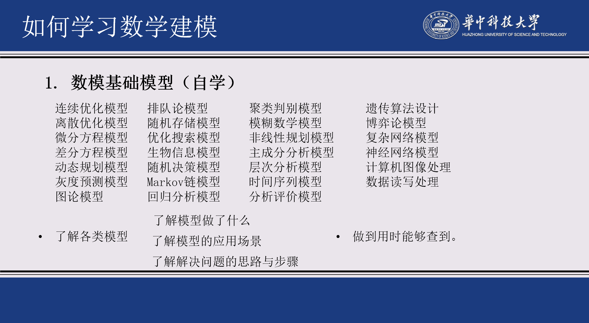

# 简介

这是闪电三连鞭队的Github仓库，存储一些数学建模比赛的资源和内容。
# ⚔战绩
2023 HUST数学建模校赛 兴趣组二等奖
# 建模

马佬的Github仓库：https://github.com/JokerZaia

# 编程

## 准备

马世拓的Python建模入门： 
https://github.com/ShituoMa/mathematical_modeling_python  
Anaconda的安装（自带很多科学库，装完就不用装Python了）： 
http://t.csdnimg.cn/QafAI   
Lingo的安装： 
https://www.zdfans.com/html/46101.html#new_xzdz  
Lingo的入门： 
https://zhuanlan.zhihu.com/p/556207002 
https://zhuanlan.zhihu.com/p/231026008  
Lingo求解整数规划问题： 
https://blog.csdn.net/weixin_43267645/article/details/106538641 
https://zhuanlan.zhihu.com/p/38042197  
Lingo的官方文档： 
https://www.lindo.com/index.php/help/user-manuals  
Matlab多目标优化算法NSGA-Ⅱ： 
https://ww2.mathworks.cn/help/gads/gamultiobj.html  

# 论文

## 准备

LaTex： https://liam.page/2014/09/08/latex-introduction/

## 排版

b站数学建模清风：https://www.bilibili.com/video/BV1Ci4y1c7Ld/  
马佬的大满贯论文合集：https://github.com/JokerZaia/mst_modelpaper 
